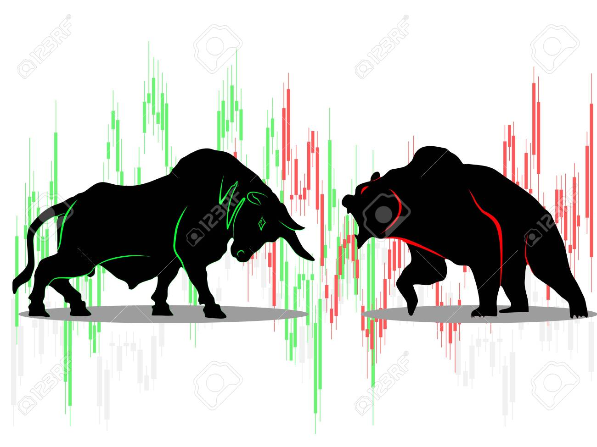

[](https://stockmarketwatch.netlify.app/)
### Table of Contents
- [StockWatch - Stock Data Viewing Tool](#stockwatch---stock-data-viewing-tool)
- [Functionality](#functionality)
- [Installtion](#installtion)
- [How to run ?](#how-to-run-)

## StockWatch - Stock Data Viewing Tool
 - This is software which provides data of stock in form of chart. This also provides live price of data. This software uses api from some website to take data. It also contain link of compnay's website.
 
* This project uses the [MERN stack](https://wikitia.com/index.php?title=MERN_(solution_stack)&mobileaction=toggle_view_desktop) :
  * [**M**ongoose.js](http://www.mongoosejs.com) ([MongoDB](https://www.mongodb.com)) : database
  * [**E**xpress.js](http://expressjs.com) : backend framework
  * [**R**eact](https://reactjs.org/) : frontend framework
  * [**N**ode.js](https://nodejs.org) : runtime environment

* Other tools and technologies used :
  * [Angular CLI](https://cli.angular.io) : frontend scaffolding
  * [Material UI](https://material-ui.com/) : layout and styles
  * [Alpaca](https://alpaca.markets/) : api for stock data

## Functionality
  - Register, Login / Logout
  - View Stock data
  - Nice Chart for showing data
  - Comapny's Fundamental data
  - Trigger
    - When price of perticular stock go above or below some limit than user will receive mail 

## Installtion
- Install [Node.js](https://nodejs.org/en/), [React](https://reactjs.org/), [MongoDB](https://www.mongodb.com/)
```python
# will download this repository locally
https://github.com/YashKanjiya/Stock_Market_Predication_and_Lookup_Final
(or manually download this project)

# will install all the dependencies for project
npm run install-dependecies
```

```python
# Ignore this !!
# Make sure you have node(javascript), gcc(c), g++(c++), jdk(java) & python installed in your system / server (which will compile code).
```


## How to run ?
```python
# will serve the project
npm start
```


# Stock_Prediction

## Introduction

-> We have stock market live pridiction in chart and also shows moving average.

-> This Project also shows to Predicted Stock Portfolio.

## Technology
- **Python**: The primary programming language used in this project.
- **Keras Library**: Utilized for building and training neural network models.
- **Numpy and Pandas Library**: Used for data manipulation and analysis.
- **Matplotlib**: Employed for data visualization.
- **Streamlit App Framework**: Utilized for building interactive web applications.
- **Sqlite3 Database**: Used for storing and querying data locally.
- **Git and GitHub**: Version control system and platform for collaborative development.

## Description
-> we have used streamlit App framework for stock prediction and manage portfolio.

-> Stock market live data fetch in yahoo website.

-> we have used last 5 year data and Pridicted Next 1 year in Stock Portfolio.

-> we Store the data in Sqlite3 database.

-> Stock Market Kears model created and 70% Testing the data and 30% data are Traning.

## Advantage
-> Stock Market Invester are used to Predicted data next 1 year Return in Portfolio.

-> also Show the charts and Pridicted Charts Shows

## Disadvantege
->  New Age or New Listed Company can't Pridicted.

## Installation

Use the package manager [pip](https://pip.pypa.io/en/stable/) to install All.

```bash
pip install conda
pip install streamlit
pip install pandas
pip install pandas-datareader
pip install numpy
pip install matplotlib
pip install keras
pip install tensorflow
pip install db-sqlite3
```


## Contributing
Pull requests are welcome. For major changes, please open an issue first to discuss what you would like to change.

Please make sure to update tests as appropriate.

## License
Yash Kanjiya

#Project:-
1) Charts


->Moving Averages:-


->Orignal vs Pridiction value:-


2)Portflio:-

-> Input


-> Output


#table:-


